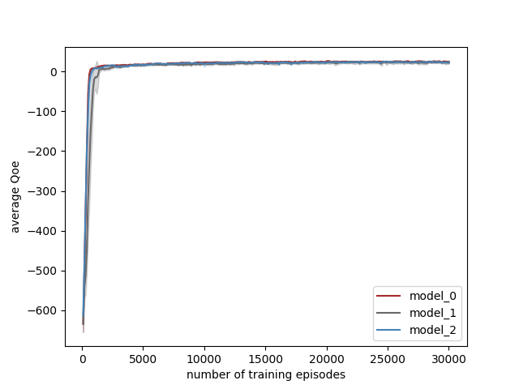
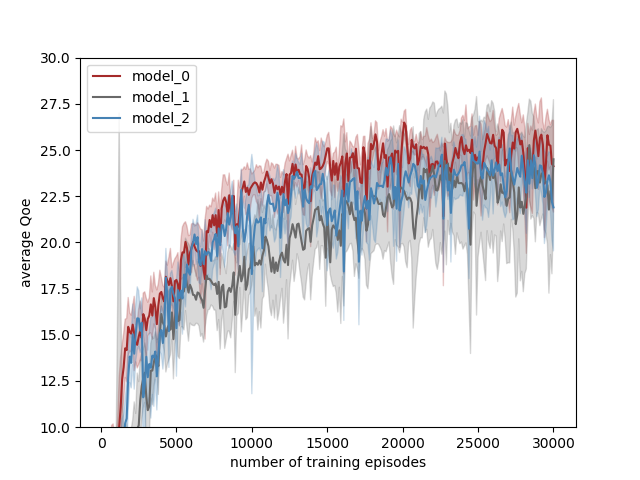

# Pensieve-pytorch-py3
Implementing [pensieve](http://web.mit.edu/pensieve/) using pytorch fork from [linnaeushuang](https://github.com/linnaeushuang/pensieve-pytorch).

The [author](https://github.com/hongzimao/pensieve) of pensieve uses tensorflow to implement it.

**@linnaeushuang** is work on the origin dataset, and I try to solve [ACM Challenge](https://github.com/AItransCompetition/Live-Video-Streaming-Challenge) with this model. 


## Dependencise:
- python3.6
- numpy
- torch 1.1.0 (with cuda 10)

### For pytorch installation
If you use pipenv and Cuda version is 10.1
```
pipenv install  #run this command in the . of this repo.
```
If not , you can got to 
https://download.pytorch.org/whl/cu{your_cuda_version}/torch-1.1.0-cp36-cp36m-linux_x86_64.whl to download the package.

For example cuda 10 then your_cuda_version will be ``cu100`` . 
### Python venv  
- Using [Pipenv](https://github.com/pyenv/pyenv)


## Simulation Part
Go to ``sim`` and read the README.md, and it's a sub module from [kerwenwwer/2021CS3570_Challenge1_Live_Video_Streaming](https://github.com/kerwenwwer/2021CS3570_Challenge1_Live_Video_Streaming)

## Trainning Part

When I used pytorch to implement it,I found a difference between the tensorflow implementation and the paper.

In ```hongzimao/pensieve/sim/a3c.py```,author used the mean square error of **R_batch** and **criticNetwork_output**(value function,in a3c.py line 243).But **R_batch** is the cumulative rewards in particular episode.In original paper,pensieve should use mean square of **r+\gamma * V(s_{t+1})** and **V(s_{t})** (paper,equation-3).

I have no idea how different between that,so I implemented 3 models to verify it:

- model 0 : only use pytorch to rewrite pensieve,no logical changes.use R_batch to update critic network.
- model 1 : according to equation-3,think of s_batch[:-1] as states,and s_batch[1:] as new states.(is that correct?)
- model 2 : no critic network,only actor network.

### Train

You can run an example:

```
python3 pensieve_torch.py --model_type=0
```

### Results

 

Figure1:testing average QoE per 100 episodes.

I use testing-function to get average QoE per 100 episodes in training,and train 6 times using seed(42,142,242,342,442,542).

I found a phenomenon that even without critic network,I can get the similar results(see model_0 and model_2).

